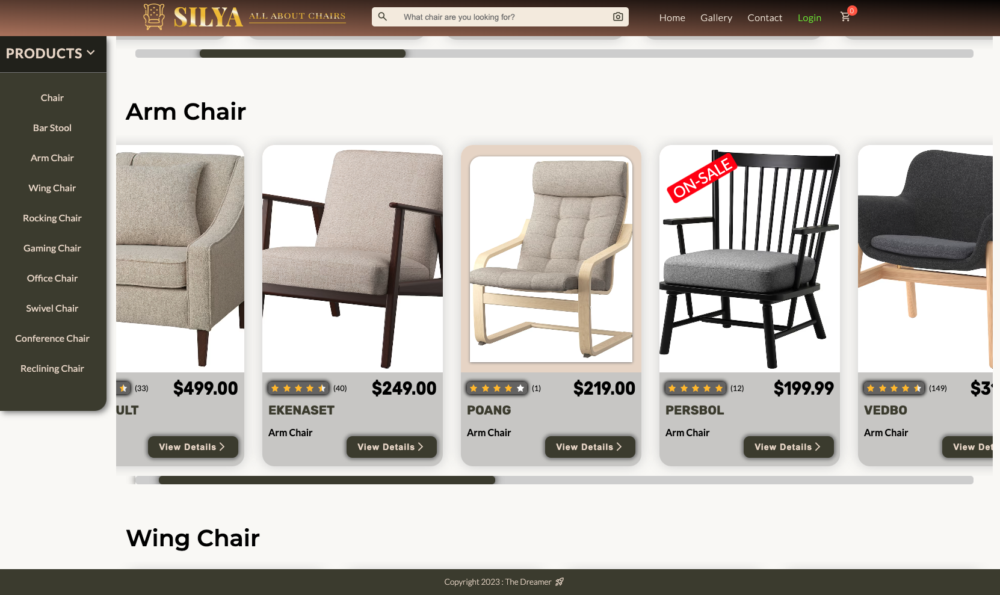
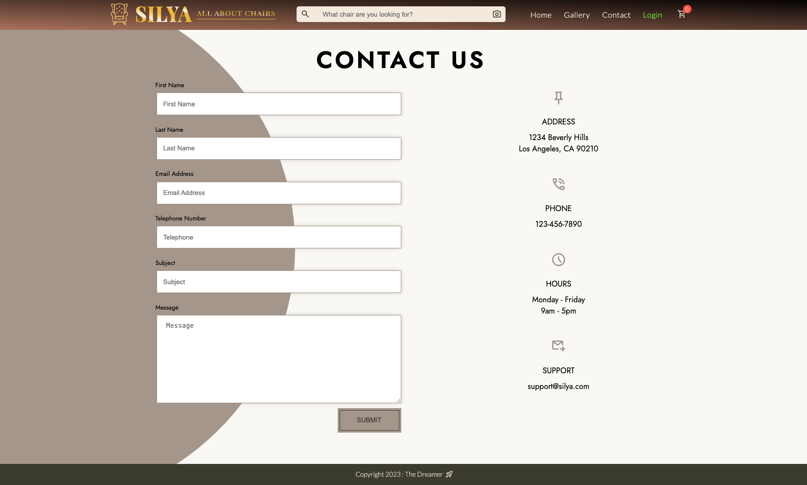
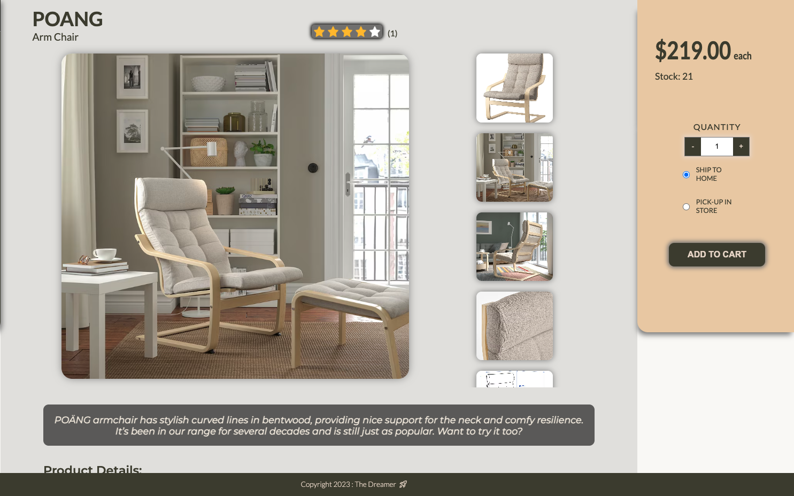
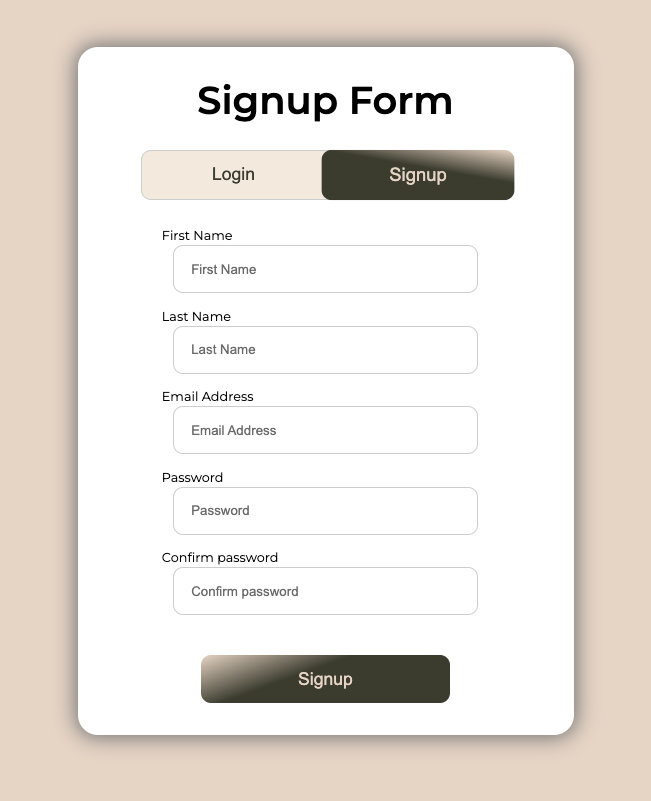
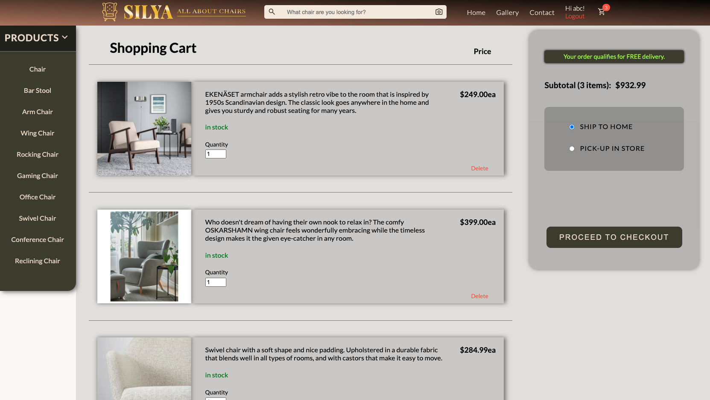
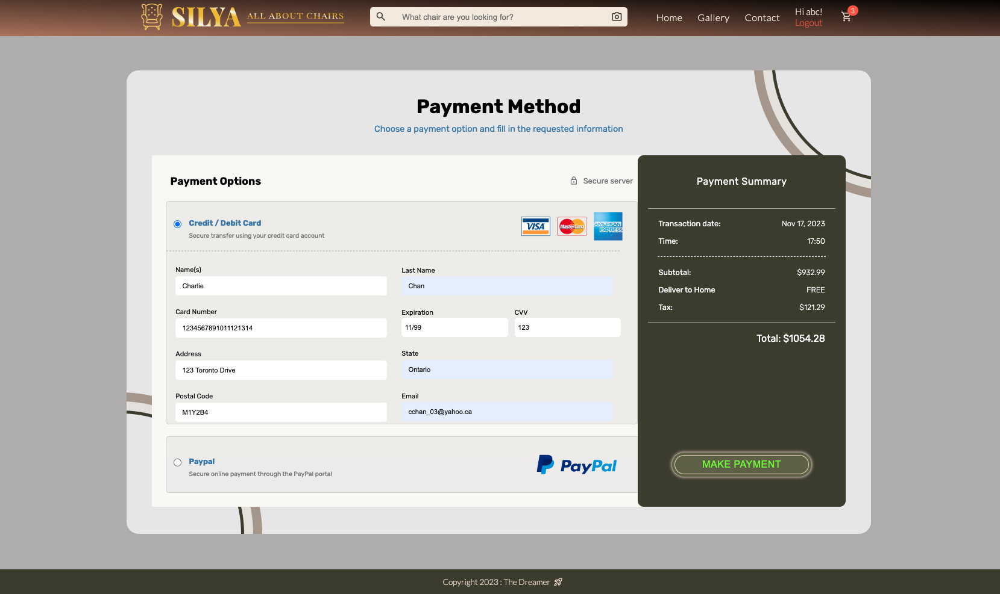

# Silya E-Commerce Website

Silya is a complete front-end e-commerce website designed for buying chairs. The website includes various features such as a home page, product gallery, contact form, login/signup functionality, and a seamless checkout process.

## Table of Contents

- [Features](#features)
- [Pages](#pages)
- [Technologies Used](#technologies-used)
- [Getting Started](#getting-started)

## Features

- Navigation bar with links to home, gallery, contact, login, and cart.
- Product categories in the navigation sidebar for easy access.
- Search functionality with a dynamic search library for quick navigation.
- Recently viewed items section to revisit previously browsed products.
- Detailed product pages with images, price, inventory, description, specifications, and materials.
- Add to cart functionality with a checkout button.
- Checkout page for reviewing and managing cart items.
- Choice of free delivery if the minimum limit price is met.
- Option to choose delivery method (home delivery or store pick-up).
- Payment page with options for credit card or PayPal payment.
- Form for credit card details and summary of the transaction.
- Smooth navigation between pages for a user-friendly experience.
- Responsive design for a seamless user experience across devices.

## Pages

### Home Page

Landing page with a header, search bar, navigation bar, and featured content.

### Gallery Page

Display of all available products categorized by chair type.

### Contact Page

Form to directly message the company and contact information.

### Detail Page

Detailed information about a specific product with an option to add to cart.

### Login/Signup Page

User authentication page for logging in or creating a new account.

### Checkout Page

Review and manage cart items, choose delivery options, and proceed to payment.

### Payment Page

Form for credit card and delivery information. Transaction summary.

## Technologies Used

- HTML
- CSS
- JavaScript
- React

## Getting Started

To run the project locally, follow these steps:

1. Clone the repository: `git clone [https://github.com/Blynx03/silya]`
2. Navigate to the project directory: `cd silya`
3. Install dependencies: `npm install`
4. Start the development server: `npm start`
5. Use abc@abc.com for the email and "abc" for the password.
